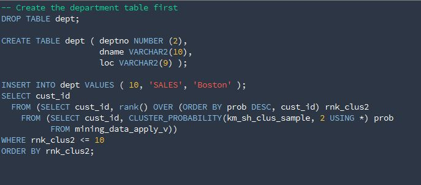

# Colour schemes for Oracle SQL Developer #

## Color schemes ##
### Chester ###

### Dracula ###

### Solarized dark ###

### VS2010 dark ###

## Installation ##

Many thanks to Ozmoroz for providing clear instructions [(Source)](https://github.com/ozmoroz/ozbsidian-sqldeveloper):

- Close SQL Developer. This is important. If you modify the scheme file while SQL Developer is open, your changes won't be saved.

- Locate file `dtcache.xml` in the SQL Developer's settings directory. On my system it is located in directory `C:\Users\sergey\AppData\Roaming\SQL Developer\system4.0.3.16.84\o.ide.12.1.3.2.41.140908.1359`

- Locate `<schemeMap>` tag inside dtcache.xml file. Insert the content of color scheme xml file inside `<schemeMap>` alongside the other colour schemes. Be careful not to break the XML.
	* [`chester.xml`](https://raw.githubusercontent.com/Gillisdc/sqldeveloper-syntax-highlighting/master/chester.xml) 	
	* [`dracula.xml`](https://raw.githubusercontent.com/Gillisdc/sqldeveloper-syntax-highlighting/master/dracula.xml) 
	* [`solarized_dark.xml`](https://raw.githubusercontent.com/Gillisdc/sqldeveloper-syntax-highlighting/master/Solarized_dark.xml) 
	* [`VS2010_dark.xml`](https://raw.githubusercontent.com/Gillisdc/sqldeveloper-syntax-highlighting/master/VS2010_dark.xml) 
	

- Launch SQL Developer. Navigate to menu Tools->Preferences, then select item Code Editor -> PL/SQL Syntax Colours in the left pane.

- Select the color scheme name in the "Scheme" drop down list on the top.

